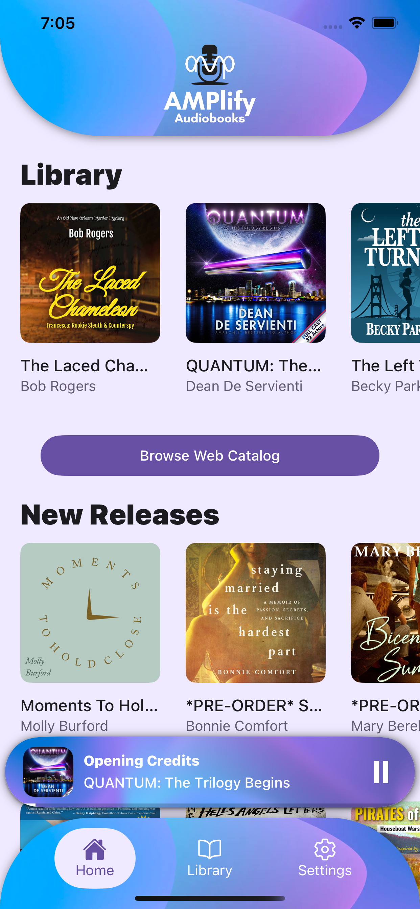

# AMPlify Audiobooks

A modern React Native audiobook player for iOS and Android, built for Pro Audio Voices. Features offline playback, seamless progress tracking, and a Material Design 3 interface.

<div align="center">
  
  
  
</div>

## Features

### Core Functionality
- **Offline Playback** - Download audiobooks for listening without an internet connection
- **Progress Tracking** - Automatically resume where you left off
- **Network Awareness** - Graceful offline mode
- **Material Design 3** - Modern, accessible UI using React Native Paper

### Playback Features
- Background audio playback with lock screen controls
- Skip forward/backward (15-second increments)
- Chapter navigation
- Progress scrubbing

### User Experience
- Pull-to-refresh book library sync
- Discover new releases from web catalog
- User authentication and account management
- Persistent now-playing card for quick access

## Tech Stack

- **Framework:** React Native 0.77.3 with Expo 52.0.27
- **Language:** TypeScript 5.6.3
- **Navigation:** React Navigation 6.x (Native Stack + Bottom Tabs)
- **UI Library:** React Native Paper 5.14.5 (Material Design 3)
- **Audio Engine:** react-native-track-player 4.1.2
- **State Management:** React Context API + Custom Hooks
- **Storage:** AsyncStorage + expo-file-system
- **Network Detection:** @react-native-community/netinfo

### Development Tools
- **Build Automation:** Fastlane (iOS + Android)
- **Code Quality:** ESLint, Prettier, TypeScript strict mode

## Architecture

### Component Organization
This project follows **Atomic Design** methodology for component organization:

```
src/components/
├── atoms/          # Basic UI primitives (buttons, cards, dialogs)
├── molecules/      # Simple compositions (lists, tiles, containers)
└── organisms/      # Complex features (forms, playback controls, tab bars)
```

See [docs/ATOMIC_DESIGN.md](docs/ATOMIC_DESIGN.md) for detailed guidelines.

### Project Structure

```
AmplifyAudiobooks/
├── src/
│   ├── components/       # UI components (atoms, molecules, organisms)
│   ├── contexts/         # React Context providers
│   ├── hooks/            # Custom React hooks
│   ├── navigators/       # Navigation configuration
│   ├── screens/          # Screen components
│   ├── services/         # Business logic and API clients
│   ├── stores/           # State management (BookStore, etc.)
│   └── types/            # TypeScript type definitions
├── android/              # Android native code
├── ios/                  # iOS native code
├── docs/                 # Documentation
├── fastlane/             # Automated build and deployment
└── assets/               # Images, fonts, and other static resources
```

### State Management
- **PlaybackContext** - Global playback state and controls
- **AuthContext** - User authentication and session management
- **UserContext** - User profile and preferences
- **ErrorContext** - Global error handling
- **LayoutContext** - Dynamic layout measurements
- **BookStore** - Data store for book library and downloads

## Getting Started

### Prerequisites

- **Node.js** >= 18
- **npm** or **yarn**
- **Xcode** 15.1+ (for iOS development, macOS only)
- **Android Studio** with Android SDK (for Android development)
- **CocoaPods** (for iOS dependencies)
- **Fastlane** (for automated builds)

See the [React Native Environment Setup](https://reactnative.dev/docs/environment-setup) guide for detailed platform-specific instructions.

### Installation

1. **Clone the repository**
   ```bash
   git clone https://github.com/seven-stars-software/amplify-audiobooks-react-native.git
   cd amplify-audiobooks-react-native
   ```

2. **Install dependencies**
   ```bash
   npm install
   ```

3. **Install iOS dependencies**
   ```bash
   cd ios && pod install && cd ..
   ```

4. **Set up environment variables**
   ```bash
   cp .env.development.default .env.development
   ```

   Edit `.env.development` with your API endpoints and configuration.

### Running the App

#### Development Mode

**iOS:**
```bash
npm expo run:ios
```

**Android:**
```bash
npm expo run:android
```

**Start Metro bundler separately:**
```bash
npm expo start
```

## Development

### Code Style

- **TypeScript strict mode** enabled
- **ESLint** for code quality
- **Prettier** for formatting
- Always use **enums** over string literals for status values
- Follow **Atomic Design** principles for component organization

### Git Workflow

- **Main branch:** `main` (protected, requires PR)
- **Feature branches:** `feature/feature-name`
- **Refactor branches:** `refactor/refactor-name`
- **Worktrees** recommended for parallel development

## Deployment

### iOS (App Store)
- TestFlight beta testing configured
- App Store Connect API integration
- Automated IPA generation via Fastlane

### Android (Google Play)
- Google Play Console integration
- Automated AAB generation via Fastlane
- Google Play App Signing enabled

#### Release Builds

This project uses Fastlane for automated builds. See [docs/FASTLANE_SETUP.md](docs/FASTLANE_SETUP.md) for complete instructions.

**Build iOS:**
```bash
npm run release:build-ios
```

**Build Android:**
```bash
npm run release:build-android
```

**Full release (version bump + build + deploy):**
```bash
npm run release
```

## Platform Support

- **iOS:** 15.1+
- **Android:** API 24+ (Android 7.0 Nougat)

## API Integration

This app communicates with a custom Node.js/Express backend API gateway that handles authentication and proxies requests to Pro Audio Voices' infrastructure:

**Backend Repository:** [seven-stars-software/amplify-backend](https://github.com/seven-stars-software/amplify-backend)

### Architecture
The backend acts as a secure API gateway that:
- Authenticates mobile app requests using sealed session tokens (@hapi/iron)
- Proxies authenticated requests to WordPress (WooCommerce) for catalog and purchase data
- Proxies authenticated requests to AWS S3 for presigned audio file URLs
- Stores API credentials server-side (WordPress API keys, AWS credentials)
- Provides a thin, mobile-friendly REST API over WooCommerce and S3

### API Features
- User authentication and session management
- Book catalog and metadata retrieval
- Purchase verification and library access
- Playback progress syncing across devices
- Presigned S3 URLs for audio file streaming/download

API endpoints are configured via environment variables in `.env.development`.

## Documentation

- **[Development Guide](docs/development.md)** - Detailed setup and development workflow
- **[Atomic Design](docs/ATOMIC_DESIGN.md)** - Component organization guidelines
- **[Fastlane Setup](docs/FASTLANE_SETUP.md)** - Build automation and deployment
- **[Changelog](CHANGELOG.md)** - Version history and release notes
- **[Project Context](.claude/PROJECT_CONTEXT.md)** - Complete project documentation for AI tools

## Credits

**Developer:** Jackson Callaway
**Client:** Pro Audio Voices
**Design:** Material Design 3 by Google

---

Built with [React Native](https://reactnative.dev) • [Expo](https://expo.dev) • [React Native Paper](https://callstack.github.io/react-native-paper/)
